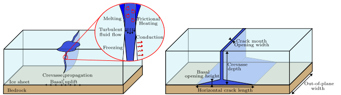

# MATLAB_IceHydroFrac:

If this code is used, please cite: T Hageman, JZ Mejia, R Duddu, and E Martinez-Paneda. Ice Viscosity Governs Hydraulic Fracture Causing Rapid Drainage of Supraglacial Lakes (2024). The Cryosphere [10.1016/j.cma.2023.116235](https://doi.org/10.1016/j.cma.2023.116235)

Matlab code performing the finite element simulation of an water-filled crevasse, propagating through and eventually lifting an ice-sheet. Full documentation is available [here](Documentation/main.pdf).