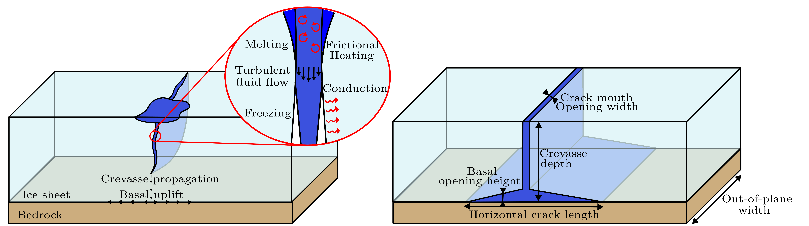

# MATLAB_IceHydroFrac:

If this code is used, please cite: T Hageman, JZ Mejia, R Duddu, and E Martinez-Paneda. Ice Viscosity Governs Hydraulic Fracture Causing Rapid Drainage of Supraglacial Lakes (2024). The Cryosphere [10.5194/egusphere-2024-346](https://doi.org/10.5194/egusphere-2024-346)

Matlab code performing the finite element simulation of an water-filled crevasse, propagating through and eventually lifting an ice-sheet. Full documentation is available [here](Documentation/main.pdf). The code allows the simulation of a single propagating crevasse through an ice-sheet, driven by a surface lake. Upon reaching the base, sideways cracks are included, allowing the subsequent uplifting to be captured. As the code allows for both visco-plastic and linear-elastic rheologies, it has been used to demonstrate the importance of including viscous effects, even on the relatively short time-scales involved with fracture propagation. As thermal effects are also included, an in-depth look at the effects of melting/freezing, thermal conduction of heat into the ice, and frictional heating within the crevasse is made possible.